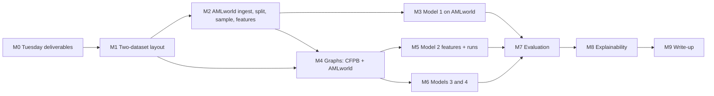

# Research plan: does a graph help fraud classification?

**Version 1, 2026-10-04.** This is the working plan for the group and for AI agents working in this repository.

- [`AGENTS.md`](../AGENTS.md) holds the hard rules (git workflow, never-commit list, leakage invariants), and they take precedence over this plan.
- Anything marked **[group decides]** is an open decision. Agents must not settle it on their own; see §11.
- When the group decides something, record it in §12 (decision log) and in the "Decided" paragraph of `AGENTS.md`, in the same PR.

Numbers such as #30 refer to GitHub issues in `caelenm/fraud-detect-gnn`.

**Who reads what:**
- **The group:** §1 (question and hypotheses), §2 (what we learned about the datasets), §3 (design), §9–§11 (compute, risks, open decisions).
- **Agents:** `AGENTS.md` first, then §3–§8 and the milestone you are assigned in §8. Each milestone lists its deliverables and acceptance criteria.

---

## 1. Question and hypotheses

**Main question.** Does using a graph improve fraud classification over the same kind of model without one?

We answer it with four models on each of two datasets. All four use the same labelled training examples and the same test examples, and are scored with the same metrics.

| # | Model | Graph information? | Message passing? |
|---|---|---|---|
| 1 | **Tabular (Model A):** df-analyze's best model on each example's own features | no | no |
| 2 | **Tabular + neighbour features:** the same df-analyze pipeline on own features plus label-free aggregates of graph neighbours' features | yes | no |
| 3 | **Graph-free control:** the GraphSAGE network of Model 4 with all edges removed (an MLP on own features) | no | no |
| 4 | **GNN:** heterogeneous GraphSAGE over the graph | yes | yes |

The contrasts that answer the question:
- **4 − 3:** the effect of message passing over the graph, with the network held fixed. This is the headline contrast.
- **2 − 1:** the effect of the graph's information on a tree model.
- **4 − 2:** message passing vs. simple aggregation, given the same graph information.

The two datasets:
- **CFPB** consumer complaints, where the graph has to be *constructed* from each complaint's attributes.
- **IBM AMLworld HI-Small**, simulated bank transactions where the graph is *observed*: each transaction moves money between two accounts.

**Hypotheses** (written on 2026-10-04, before any graph model exists; do not revise them after seeing test results):

| | Hypothesis | Why we expect it |
|---|---|---|
| H1 | **CFPB:** 4 ≈ 3 and 2 ≈ 1. The graph adds little. | The edges (company, product, state) are built from columns Models 1 and 3 already see. Consumers are anonymous, so there are no links between people or accounts. This was the prof's point 3. |
| H2 | **AMLworld:** 2 > 1 and 4 > 3, by a clear margin. | Laundering is defined by patterns spanning several transactions (fan-out, fan-in, cycles, scatter-gather; §2.2). A single transaction's own attributes cannot show them. |
| H3 | **AMLworld:** 2 ≥ 4 is plausible. | GADBench found that tree ensembles with simple neighbourhood aggregation can beat recent GNNs. IBM found that gradient boosting on graph-derived features beats standard GNNs on AMLworld. Plain GraphSAGE also lacks the adaptations (port numbering, ego IDs, reverse message passing) that IBM showed matter for these patterns. |
| H4 | **Feature groups:** text dominates on CFPB; neighbour information dominates on AMLworld. | It follows from H1 and H2. On CFPB it also tests the prof's point 1, that the CFPB model is mostly a fraud-*topic* text classifier. |

Every outcome is a result. If H1 and H2 both hold, the story is "graphs help when the relationships are observed, not when they are constructed from the features".

---

## 2. Datasets: what we know

### 2.1 CFPB Consumer Complaint Database (Narratives Archive files 2–4)

**Source and window.**
- The CFPB Narratives Archive, files 2, 3 and 4: complaints received May 2018 to August 2023.
- In August 2026 the CFPB stopped publishing narratives in the live database and moved them to its FOIA Reading Room as fixed, public-domain bulk files. The archive is therefore a reproducible snapshot.
- The window is a fixed design decision; see the README for the reasons.

**How a complaint gets its fields.**
- The consumer chooses Product, Sub-product, Issue and Sub-issue on the complaint form and writes the narrative.
- Narratives are published only with the consumer's consent, after the CFPB has removed personal information.
- Complaints are unverified allegations.

**Taxonomy history (relevant to the shortcut check).**
- On **24 April 2017** the CFPB merged its 11 complaint forms into one, reduced the product options from 12 to 9, and revised the issue wording. That predates our window, so all of our data uses the post-2017 taxonomy.
- In **2023**, "Credit card or prepaid card" split into **"Credit card"** and **"Prepaid card"**, and **"Debt or credit management"** appeared. The first two are target products; the third is excluded.
- The exact month of the split can be read from `label_audit_product_span.csv` (stage 13).

**The label (rule version 2, decided 2026-09-29; [`docs/LABEL_RULE.md`](LABEL_RULE.md)).**
- An explicit allow-list of (Product, Issue, Sub-issue) combinations meaning fraud, a scam, identity theft or an unauthorized transaction.
- Ambiguous categories are *excluded*, not labelled 0.
- Before deduplication: 98,723 of 334,773 labelled target-product complaints are positive (29.5%), and 20,266 are excluded.
- Debt collection is 39.6% fraud and supplies 62% of the positives.

**Sample and split.** After near-duplicate removal (MinHash, Jaccard ≥ 0.85), 30,000 complaints at the natural rate (28.4% fraud), split 60/40 stratified into 18,000 train and 12,000 test.

**Current Model A** (rule v2, one run, seed 555, as reported to the prof):

| Metric | Value |
|---|---|
| Best model | CatBoost |
| Test PR-AUC | 0.733 (no-skill baseline 0.284) |
| Accuracy | 0.813 |

The prof also noted:
- Several tuning gains are negative, because models are tuned on balanced accuracy but chosen on PR-AUC; df-analyze offers no PR-AUC tuning metric (#5).
- Logistic regression hit its time limit on three feature sets (#31).

**What this means for the graph.**
- There is no observed network. Company, product and state edges connect complaints to shared category nodes, so a GNN aggregating over them mostly re-encodes columns the tabular model already uses.
- Large companies are hubs with thousands of complaints.
- Text-similarity edges would come from the same embeddings Model 1 sees.

**Known risks.**
- **Topic classifier:** the model is a fraud-*topic* classifier (describe it as "classifying fraud-related complaints").
- **Taxonomy shortcut:** checked by `label_audit`, §10.
- **Templated complaints:** these survive deduplication.
- **Consumer-chosen labels:** the category is the consumer's own choice, not verified fraud.

### 2.2 IBM AMLworld (HI-Small)

**Source.**
- Altman et al., *Realistic Synthetic Financial Transactions for Anti-Money Laundering Models*, NeurIPS 2023 Datasets and Benchmarks.
- An agent-based simulator of individuals, companies and banks, calibrated against real transaction data.
- It models the whole laundering cycle: placement, layering, integration.

**Why its labels are unusual.**
- **Complete:** every laundering transaction is tagged, whereas in real data most laundering is never detected.
- **Transitive:** if A pays B illicit funds and B passes some on to C, the whole chain is labelled laundering.

**Access.**
- Kaggle dataset `ealtman2019/ibm-transactions-for-anti-money-laundering-aml`, which needs a free Kaggle account. We use `HI-Small_Trans.csv`, and optionally `HI-Small_Patterns.txt` for evaluation only (see below).
- Never commit either file or `kaggle.json`.

**The six datasets** (paper's table; we use HI-Small and verify its numbers on load):

| Set | Bank accounts | Transactions | Laundering | Rate |
|---|---:|---:|---:|---:|
| **HI-Small** | 515K | 5M | 5.1K | 1 in 981 |
| LI-Small | 705K | 7M | 4.0K | 1 in 1,942 |
| HI-Medium | 2,077K | 32M | 35K | 1 in 905 |
| LI-Medium | 2,028K | 31M | 16K | 1 in 1,948 |
| HI-Large | 2,116K | 180M | 223K | 1 in 807 |
| LI-Large | 2,064K | 176M | 100K | 1 in 1,750 |

At about 0.1% positives, the no-skill PR-AUC on HI-Small is about 0.001. One later paper reports HI-Small's illicit ratio as 0.07%, so the **loader must report the exact counts**.

**Columns of `HI-Small_Trans.csv`:**
- `Timestamp` (`YYYY/MM/DD HH:MM`)
- `From Bank`, `Account` (sender)
- `To Bank`, `Account` (receiver; pandas reads it as `Account.1`)
- `Amount Received`, `Receiving Currency`
- `Amount Paid`, `Payment Currency`
- `Payment Format`
- `Is Laundering`

IBM's preprocessing (`format_kaggle_files.py`) identifies an account by **bank + account number** and sorts transactions by time. To check on load, rather than assume:
- the payment-format values (reported to include ACH, cheque, credit card, wire, cash, Bitcoin and reinvestment);
- the number of currencies;
- whether self-transfers exist (same sender and receiver account);
- how often the same account pair transacts repeatedly (the graph is a multigraph).

**Laundering patterns** (eight typologies in `HI-Small_Patterns.txt`, as reported by later work using the file; verify):

| Pattern | Laundering transactions |
|---|---:|
| Fan-out | 342 |
| Fan-in | 318 |
| Gather-scatter | 716 |
| Scatter-gather | 626 |
| Cycle | 287 |
| Random | 191 |
| Bipartite | 263 |
| Stack | 466 |
| Not in a listed pattern | 1,968 |
| **Total** | **5,177** |

The total is consistent with the paper's 5.1K. Each listed pattern spans several transactions. That is why we expect the graph to help here (H2), and it gives a per-pattern breakdown for evaluation (§6). The pattern file may be used **only for evaluation breakdowns, never as features or for training**.

**The literature's protocol** (IBM's Multi-GNN code, `data_loading.py` and `train_util.py`):
- **Split:** by **day**, with the two day boundaries chosen to land closest to 60/20/20 of transactions.
- **Normalisation:** z-normalised with training statistics.
- **Inductive graphs:** the training graph holds training edges only, the validation graph training + validation edges, and the test graph all edges.
- **Metric:** **minority-class F1** at the arg-max decision.

**Published findings** (state them in words; the exact numbers are to be copied from the papers' tables. arXiv was unreachable from the environment that wrote this plan, so an agent with access must fill them in):
- Egressy et al. (AAAI 2024, Multi-GNN): port numbering, ego IDs and reverse message passing raise a standard GNN's minority-class F1 by up to about 30 points, matching or beating tree baselines.
- Blanuša et al. (2024, Graph Feature Preprocessor): gradient boosting on graph-derived features (fan-in/out, cycles, scatter-gather) beats standard GNNs on minority-class F1.

**What this means for us.**
- **Observed, temporal, multigraph, directed:** the graph is all four, and extremely imbalanced.
- **Not comparable with published results:** we train every model on a shared case-control sample (§3.2), whereas published results train on every transaction. Report the published numbers only for orientation.
- **Synthetic:** conclusions are about the simulation.

---

## 3. Experimental design

### 3.1 The same-data rule

All four models on a dataset use the same labelled training examples and the same test examples. Models 2 and 4 additionally see the graph around those examples, *without labels*.

| | CFPB | AMLworld HI-Small |
|---|---|---|
| **Labelled training examples** | the 18,000 training complaints (`train_ids.csv`) | the shared **case-control sample**: every laundering transaction from the training days plus a seeded random sample of the others, spread across the training days, about 30,000 rows; IDs saved |
| **Validation** (model choice, thresholds, early stopping) | Models 1–2: `select_model`'s shared 5-fold CV on the training set. Models 3–4: a fixed stratified 20% of the training IDs, then **refit on all training IDs** for the chosen number of epochs, so the labelled data matches Models 1–2 **[group decides]** | the **validation days**, full and at the natural rate, for all four models |
| **Test** (touched once) | the 12,000 test complaints (`test_ids.csv`) | the **test days**, full and at the natural rate |
| **Graph context** (Models 2, 4 only) | training complaints and their company, product and state nodes; test complaints attached at evaluation | every transaction up to the period being scored, without labels |

**Why AMLworld uses validation days instead of training CV.** PR-AUC on a roughly 10%-positive case-control sample does not rank models the way it would at about 0.1%.

**Why the case-control sample is fine for ranking metrics.** Sampling negatives changes predicted probabilities but not how examples are ranked, so PR-AUC and AUROC are unaffected. Decision thresholds come from the natural-rate validation days.

### 3.2 Metrics and how contrasts are judged

- **Headline: PR-AUC** (average precision) on the test set. Report the no-skill baseline (the test positive rate) next to it.
- **Also:** AUROC, and positive-class F1, precision and recall at a decision threshold. Every model uses the same rule, chosen on validation data and never on test: the threshold that maximises validation F1 **[group decides]**.
  - On AMLworld a fixed 0.5 cut-off is meaningless after case-control sampling.
  - On CFPB the current Model A report uses each model's default rule. Switching to the validation rule changes F1, precision and recall but not PR-AUC or AUROC.
- **Seeds:** Models 3 and 4 run at least 5 seeds; report mean ± standard deviation.
- **Uncertainty for every contrast** (proposed, **[group decides]**): a paired bootstrap over test examples (1,000 resamples) gives a 95% interval for each difference (4−3, 2−1, 4−2). For neural models, pool the seed-mean predictions. A contrast counts as "the graph helps" only if its interval excludes 0. Without this, single-run tabular scores cannot be compared fairly with seed-averaged neural scores.
- **AMLworld extra:** minority-class F1 at the validation-chosen threshold, for orientation against the literature, which is not directly comparable.

### 3.3 Tuning effort

- **Models 1 and 2:** df-analyze tunes each classifier on each of its 4 feature sets with up to 100 Optuna trials and per-model time limits. The trials completed are recorded in `tuning_budget.csv`.
- **Models 3 and 4:** the same small search on validation (§5.2), with the identical search for both so their contrast is fair. Record the budget.
- **State the asymmetry plainly in the write-up.** The tabular side gets a much larger automated search than the neural side.

---

## 4. Dataset protocols

### 4.1 CFPB

**Stages 1–13 already exist** (`uv run run.py --list`). Still to build:

- **Split decision (before any graph work).** Run `label_audit` and look at the fraud rate by product × year. If a renamed product's rate differs sharply from its predecessor's in the same period, the product name and date leak the label, and a time-based split becomes the candidate **[group decides]**. A split change means rerunning stages 4–12, about 5 h. Do it before building the graph models, not after.
- **Graph:** exactly the README's "Graph schema (CFPB), in one paragraph" (#7).
  - Complaint nodes carry Model A's features.
  - Company nodes carry training-only statistics, with a fallback node for companies not seen in training.
  - Product and region nodes have learned embeddings.
  - Reverse edges throughout.
  - Test complaints are attached only at evaluation.
  - kNN text-similarity edges are **[group decides]**. Recommendation: leave them out of the main graph and run them as an ablation, because they come from the same embeddings Model 1 uses.
- **Model 2 features (GADBench recipe, adapted).** For each relation r in {company, product, state}, take the mean of the own features (text components and tabular features) of the *training* complaints that share r.
  - **Training complaints:** leave-one-out, excluding the complaint itself, so the feature is computed the same way as for a test complaint. This is the same logic as the existing company statistics.
  - **Test complaints:** all training complaints that share r.
  - **Never labels.**
  - These are the 2-hop (complaint → category → complaint) aggregates of a parameter-free GIN, the GADBench construction. The 1-hop aggregate is the company node's own statistics, which Model 1 already has.

### 4.2 AMLworld HI-Small: proposed stages

These depend on the pipeline layout decision in §8 (M1).

1. **`aml_load`:**
   - Read the CSV with explicit dtypes and build account IDs as bank + account.
   - Report total, account and laundering counts against the paper's table.
   - Report counts per day (transactions and laundering), currency and payment-format counts, self-transfers, and repeated account pairs.
   - Counts only, under `outputs/amlworld/reports/`.
   - **Stop and report** if the day profile shows something the 60/20/20 split cannot handle, for example trailing days that contain almost only laundering.
2. **`aml_split`:** day boundaries chosen exactly as in Multi-GNN (the pair of days that minimises the largest relative deviation from 60/20/20 of transactions). Save the transaction IDs for each part.
3. **`aml_sample`:** the shared case-control training sample, about 30,000 rows: every training-day laundering transaction plus a seeded uniform sample of training-day non-laundering transactions, stratified by day. Save the IDs.
4. **`aml_features`** (own features of each transaction):
   - log-amount paid and received;
   - payment and receiving currency, and a currency-mismatch flag;
   - payment format;
   - same-bank and self-transfer flags;
   - hour of day and day of week.

   **Never** account or bank IDs or absolute time.
5. **Model 1:** the existing df-analyze stages on the sample, with two changes:
   - Model A is chosen by **validation-day PR-AUC**. This needs a df-analyze-environment script, like `cv_select.py`, that refits each tuned combination on the full training sample and predicts the validation and test days.
   - Test scoring comes from that refit, because df-analyze cannot process a million-row test file itself. Verify on a small subset that the refit reproduces df-analyze's own predictions.
6. **Graph:** README "Graph schema (AMLworld)".
   - Transaction nodes carry their own features; account nodes carry a constant.
   - Edges run account → transaction → account, with reverses.
   - The training graph holds training days only; the validation and test days are added when those periods are scored.
7. **Model 2 features:** for each transaction, aggregates over the sending and receiving accounts' *other* transactions in the graph up to the period being scored, kept separate for in- and out-going:
   - counts (fan-in, fan-out);
   - the number of distinct counterparties;
   - means of the own features (amounts, format and currency shares);
   - the time since the account's previous transaction.

   This is the 2-hop parameter-free aggregation of GADBench, plus degree counts. Graph-pattern features from IBM's Graph Feature Preprocessor (cycles, scatter-gather) are an optional extension. **Never `Is Laundering` of any other transaction**, including past training ones.

---

## 5. Model specifications

### 5.1 Models 1 and 2 (df-analyze)

| Setting | Value |
|---|---|
| Classifiers | `lgbm`, `lr`, `catboost`, `gandalf`, `rf`, `knn`, plus the automatic dummy (never chosen) |
| Tuning metric | `bal-acc` |
| Prediction filter | `--filter-pred-classify auroc` |
| Trials | 100 |
| Wrapper selection | off |
| Choice of Model A | CFPB: shared 5-fold CV PR-AUC on the training set (`select_model`). AMLworld: validation-day PR-AUC. |

**How Model 2 is fitted [group decides] (#29):**
- **(a)** a full df-analyze run on the extended features, chosen the same way as Model A. Cleanest, but about 4 h per dataset.
- **(b)** Model A's chosen classifier and feature-selection method, retuned on the extended features. Cheaper.
- Recommendation: (a) on both datasets if time allows.

### 5.2 Models 3 and 4 (GraphSAGE and its control)

**Architecture.**
- PyG `to_hetero(GraphSAGE)` with mean aggregation, and a linear head on the target node type (complaint or transaction).
- Model 3 is the **same class with an empty edge set**. A SAGE layer with no neighbours reduces to its self term, so it is exactly an MLP on own features.
- Implement "no edges" by keeping every edge type with an empty `edge_index`. Do not drop the relations: `to_hetero` updates a node type only through its incoming edge types, so dropping them would leave the target nodes without output.

**Inputs.** Model 1's own features: one-hot categoricals and numeric features standardised with training statistics.

**Training.**
- Neighbour sampling (`NeighborLoader`) with fan-out [15, 10] per relation, which caps hub companies and accounts.
- Batch size 1,024 target nodes.
- AdamW, weight decay 1e-5.
- Class-weighted BCE, with `pos_weight` = negatives / positives in the labelled training set.
- At most 100 epochs, early stopping with patience 10 on validation PR-AUC.

**Search** (identical for Models 3 and 4, on validation, seed 0):

| Setting | Values |
|---|---|
| Layers | 1, 2 |
| Hidden size | 64, 128 |
| Learning rate | 1e-3, 3e-3 |
| Dropout | 0.2, 0.5 |

Then 5 seeds at the chosen setting. If 16 configurations are too slow on AMLworld, fix the layers at 2 and record the reduction.

**Evaluation is inductive** (AGENTS.md invariant 7 and the AMLworld rules). Validation inference on AMLworld covers about a million transactions. Use PyG layer-wise full-graph inference, or validate every few epochs, and record what was used.

**Resumable.** One unit per (dataset, model, seed) via `ctx.unit_store` (AGENTS.md "Pipeline stages"), with a stop-and-resume test.

**Platforms.** Check `torch.cuda.is_available()`; macOS has no CUDA. Add `torch` and `torch-geometric` with `uv add`, and confirm they install on Python 3.11–3.13 on Linux, macOS and WSL2.

---

## 6. Evaluation outputs (#9)

For each dataset:
- **Main table:** one row per model, with PR-AUC (and bootstrap interval if adopted), AUROC, F1, precision, recall, the no-skill baseline, seeds, and the tuning budget.
- **Contrast table:** 4−3, 2−1 and 4−2, each with its interval if adopted.
- **Precision-recall curves:** all four models on one plot.
- **Per-example test probabilities** for every model and seed, saved under `outputs/` for agreement and explainability. They contain row-level data, so they are never committed.
- **AMLworld only:** recall per laundering pattern (from `HI-Small_Patterns.txt`) at the validation-chosen threshold. It shows which patterns the graph helps with; the pattern file is never used for training.
- **CFPB only:** results by product, because the fraud rate differs strongly between products.
- **Web report:** fill the reserved Model B and agreement sections of `web_report`; do not make a second page.

**Write-up rules.**
- Describe CFPB as classifying fraud-related complaints, and state that AMLworld is synthetic and that our AMLworld numbers are not comparable with published ones.
- Report seeds and variance.
- Never overstate a contrast whose interval includes 0.

---

## 7. Explainability (#10)

- **Models 1 and 2:** SHAP on the chosen model (TreeExplainer for tree models).
- **All four models:** feature-group permutation importance on the test set, computed identically for each model.
  - CFPB groups: text, company, product, region, complaint metadata (`feature_groups.json`).
  - AMLworld groups: own attributes vs. neighbour aggregates.
  - This tests H4.
- **Model 4:**
  - **Edge-type ablations:** retrain without one relation at a time and report the PR-AUC drop. CFPB relations: company, product, region (and similarity, if added). AMLworld relations: sender edges, receiver edges.
  - **GNNExplainer case studies:** a handful of correct and incorrect test predictions, as illustrations, not statistics.

---

## 8. Milestones and work breakdown

Each milestone becomes one or more PRs from a `feat/`, `fix/`, `exp/` or `docs/` branch (AGENTS.md). Each must include tests on synthetic data from `tests/synthetic.py` and the leakage checklist.

| | Goal | Issues | Deliverables | Accepted when |
|---|---|---|---|---|
| **M0** | Answer the prof by Tuesday 2026-10-06 | #32 | PR #28 merged; `label_audit.md` from the real data; this plan reviewed | The group has the table and the graph schema paragraphs. The CFPB split question is decided or scheduled. |
| **M1** | Run the pipeline per dataset without touching existing CFPB outputs | #30 | A short design note plus a PR. Recommended layout: a `dataset:` key, `configs/amlworld.yaml` with its own `data/amlworld/` and `outputs/amlworld/` paths, and a stage list per dataset that reuses the shared stages. **CFPB paths stay exactly as they are**, so no rerun is triggered. | The group agrees the layout. `uv run run.py --config configs/amlworld.yaml --list` works. CFPB behaviour is unchanged (existing tests pass). |
| **M2** | AMLworld data ready for all models | #30 | `aml_load`, `aml_split`, `aml_sample`, `aml_features`; a counts-only data report | The counts are checked against §2.2. Day boundaries follow Multi-GNN. Sample IDs are saved and seeded. Tests show train, validation and test days are disjoint, the sample contains every training-day laundering transaction, and no feature is an ID or absolute time. |
| **M3** | Model A on AMLworld | #30 | df-analyze run (pilot with `--set df_analyze.htune_trials=10` first); validation-day selection and refit-scoring script | Refit predictions match df-analyze's on a check subset. Selection never reads the test days. |
| **M4** | Both graphs as PyG `HeteroData` | #7, #30 | Graph builders and stage(s) | Tests: the training graph has no test nodes or edges (and on AMLworld, no validation or test days); no node feature correlates perfectly with the label on synthetic data; reverse edges are present; the edge counts are reported. |
| **M5** | Model 2 on both datasets | #29 | Aggregate features (§4) and df-analyze runs per the §5.1 decision | Tests: aggregates use no labels; CFPB test complaints never aggregate over test complaints; AMLworld aggregates use only the graph up to the scored period; leave-one-out holds for CFPB training complaints. |
| **M6** | Models 3 and 4 on both datasets | #8 | Training stage with units per (dataset, model, seed); the search in §5.2 | Model 3 is the Model 4 class with no edges. A stop-and-resume test passes. CPU fallback works. The seeds and the search are logged. |
| **M7** | The comparison | #9 | §6 tables and plots; web report sections | All four models are scored by one function. Intervals are included if adopted. The no-skill baseline is shown. |
| **M8** | Explanations | #10 | §7 outputs | Permutation importance is computed identically for all models. |
| **M9** | Write-up and presentation | — | Report and slides | The claims follow §6's write-up rules. |

**Side work that can run in parallel:**
- #31: why logistic regression hits its time limit.
- #4: hand-check a random sample of labels.
- #14: CI running ruff and pytest on Python 3.11–3.13.
- #11: company-holdout split (open decision).
- #12: df-analyze scales train and test together.
- #13: report the df-analyze bug upstream.

---

## 9. Compute budget

Measured on an RTX 4060 laptop GPU (WSL2/Linux) unless marked as an estimate. **Ask before starting any job expected to take more than about 1 hour** (AGENTS.md).

| Job | Time |
|---|---|
| CFPB `embed` (30,000 narratives, GPU) | 24 min (measured) |
| CFPB `df_analyze` (6 classifiers × 4 feature sets, 100 trials) | 4 h 07 min (measured 2026-09-28) |
| CFPB `select_model` (tuned + default settings) | about 35 min (measured about 17 min for tuned only) |
| AMLworld load, split, sample, features (5M rows) | minutes (estimate); the CSV is a few hundred MB, so read it with explicit dtypes |
| AMLworld `df_analyze` on about 30,000 rows with about 15 features | 1–4 h (estimate); **run the pilot first** |
| Model 2 df-analyze runs, option (a) | about 4 h per dataset (estimate) |
| CFPB GNN, per seed | minutes (estimate: about 30K nodes plus category nodes) |
| AMLworld GNN, per seed | 10–60 min (estimate); dominated by validation inference over about a million transactions |
| The §5.2 search (16 configs × 2 models × 2 datasets) | the largest neural cost; plan it as a resumable multi-hour job |

---

## 10. Risks and mitigations

| Risk | Effect | Mitigation |
|---|---|---|
| **CFPB taxonomy shortcut** (prof's point 2) | A random split rewards product × date instead of text | `label_audit` before graph work; a time-based split if needed **[group decides]**; decide early (rerun ≈ 5 h) |
| **The CFPB graph adds nothing** (H1) | GNN ≈ control | Expected and reported. AMLworld supplies the contrast. |
| **AMLworld day profile** (uneven days, trailing laundering-only days) | A distorted day-based split | `aml_load` reports per-day counts and stops on anomalies; the group decides any adjustment |
| **AMLworld count discrepancies between sources** | Wrong rates reported | The loader checks and reports exact counts; the README cites them |
| **Case-control sampling** | Probabilities are miscalibrated; results not comparable with published ones | Ranking metrics are unaffected; thresholds come from validation days; the limitation is stated |
| **df-analyze cannot score a million test rows** | No test predictions | Score with df-analyze's own refit code, checked against df-analyze on a subset |
| **Unequal tuning effort** (100 df-analyze trials vs a small neural grid) | Bias toward the tabular models | The same grid for Models 3 and 4; budgets reported; the asymmetry stated |
| **Single-run tabular vs multi-seed neural** | Unfair comparison of noise | Paired bootstrap intervals **[group decides]** |
| **Plain GraphSAGE lacks Multi-GNN's adaptations** | Model 4 underperforms published GNNs | Not our question (4 vs 3 holds the architecture fixed); state it; Multi-GNN adaptations are out of scope |
| **Hub nodes** (big banks, busy accounts) | Memory and over-smoothing | Neighbour sampling caps the fan-out |
| **Laptop limits** (8 GB GPU; macOS without CUDA) | Slow or failing runs | CPU fallback; resumable units; pilot runs; share outputs with `pack_artifacts.py` |
| **Synthetic AMLworld** | Limited external validity | Stated in every result |

---

## 11. Open decisions [group decides]

Agents must not settle these. Recommendations are given to speed the discussion up.

| # | Decision | Options | Recommendation |
|---|---|---|---|
| D1 | CFPB split | random stratified (current) / time-based / company-holdout (#11) | Decide after `label_audit` on the real data; time-based if a shortcut shows |
| D2 | CFPB kNN similarity edges, and k | none / include (k = 5–20) / ablation only | Ablation only (they reuse Model 1's embeddings) |
| D3 | How Model 2 is fitted | (a) full df-analyze run / (b) retune Model A's classifier | (a) if time allows |
| D4 | Uncertainty for contrasts | seeds only / plus a paired test-set bootstrap | Add the bootstrap (§3.2) |
| D5 | Decision threshold for F1, precision and recall | each model's default / validation-chosen for all | Validation-chosen for all (required on AMLworld) |
| D6 | CFPB neural validation | fixed 20% validation then refit on all training IDs / no refit | Refit, so the labelled data equals Models 1–2's |
| D7 | Neural search size | §5.2 grid / smaller | §5.2 grid; shrink only on AMLworld if needed, and record it |
| D8 | Calendar | dates for M1–M9 and the final deadline | Set at the Tuesday meeting |

Already listed in AGENTS.md as needing the group: changing the target (e.g. company response), adding architectures beyond GraphSAGE, changing the label rule, the metrics, the embedding model, or the number of PCA components.

---

## 12. Decision log

| Date | Decision |
|---|---|
| 2026-09 | Data: CFPB archive files 2–4 (May 2018–Aug 2023); 30,000-complaint sample at the natural fraud rate; region = state; PCA fit on training complaints only |
| 2026-09-29 | Label rule v2 (`docs/LABEL_RULE.md`): reviewed allow-list, ambiguous categories excluded |
| 2026-09 | Model A: df-analyze classifiers `lgbm`, `lr`, `catboost`, `gandalf`, `rf`, `knn`; tuned on balanced accuracy; chosen by shared 5-fold CV PR-AUC (`select_model`); MLP dropped |
| 2026-10-04 | The question is one GNN-vs-no-GNN comparison: the four-model ladder (§1) |
| 2026-10-04 | Second dataset: IBM AMLworld HI-Small (Elliptic dropped: Bitcoin-only) |
| 2026-10-04 | AMLworld transactions are nodes (account → transaction → account); split by day 60/20/20 |
| 2026-10-04 | Every model on a dataset uses the same data; on AMLworld, the shared case-control sample of training-day transactions |
| 2026-10-04 | CFPB task described as classifying fraud-related complaints; GNN explainability in scope; calibration, a separate transfer study, and architectures beyond GraphSAGE out of scope |

---

## 13. Checklist for agents

1. Read `AGENTS.md` fully, then this plan. Where they disagree, `AGENTS.md` wins. Point out the conflict in your PR.
2. Take one milestone or issue. Create a branch from an up-to-date `main`. Keep the PR to one stage or concern.
3. Never decide a §11 item. If your work needs one, stop and ask, or implement it behind a config option with no default chosen.
4. Add every new stage to `STAGES` with a `scripts/NN_<stage>.py` wrapper.
   - Report-only stages that read early outputs go **at the end** of `STAGES`, so they never force long stages to rerun.
   - Long stages save per-unit results and support `--resume`.
   - Outputs are written atomically.
5. Tests use only synthetic rows from `tests/synthetic.py`, written to `tmp_path`. Never commit data, outputs, Kaggle files or credentials.
6. Run `uv run ruff check .`, `uv run ruff format --check .` and `uv run pytest`. Check `git status` and `git diff --staged` before every commit.
7. Ask before starting any job expected to take more than about 1 hour. For new long jobs, run a pilot first.
8. The PR description says what changed, why, how it was tested, on which platforms, and gives the leakage checklist.
9. When a decision is made, update §12 here and the "Decided" paragraph in `AGENTS.md` in the same PR.

---

## 14. References

- Altman, E., Blanuša, J., von Niederhäusern, L., Egressy, B., Anghel, A., Atasu, K. (2023). *Realistic Synthetic Financial Transactions for Anti-Money Laundering Models.* NeurIPS Datasets and Benchmarks. https://arxiv.org/abs/2306.16424 · data: https://www.kaggle.com/datasets/ealtman2019/ibm-transactions-for-anti-money-laundering-aml
- Egressy, B., von Niederhäusern, L., Blanuša, J., Altman, E., Wattenhofer, R., Atasu, K. (2024). *Provably Powerful Graph Neural Networks for Directed Multigraphs.* AAAI 38(10). https://arxiv.org/abs/2306.11586 · code: https://github.com/IBM/Multi-GNN
- Blanuša, J. et al. (2024). *Graph Feature Preprocessor: Real-time Subgraph-based Feature Extraction for Financial Crime Detection.* https://arxiv.org/abs/2402.08593
- Tang, J., Hua, F., Gao, Z., Zhao, P., Li, J. (2023). *GADBench: Revisiting and Benchmarking Supervised Graph Anomaly Detection.* NeurIPS Datasets and Benchmarks. https://arxiv.org/abs/2306.12251 · code: https://github.com/squareRoot3/GADBench (tree + graph detectors: parameter-free GIN, mean aggregation, own features concatenated with 1- and 2-hop aggregates)
- Hamilton, W., Ying, R., Leskovec, J. (2017). *Inductive Representation Learning on Large Graphs* (GraphSAGE). NeurIPS.
- Lv, Q. et al. (2021). *Are We Really Making Much Progress? Revisiting, Benchmarking, and Refining Heterogeneous Graph Neural Networks.* KDD. https://arxiv.org/abs/2112.14936
- CFPB (2017). *Summary of Product and Sub-product Changes* (effective 24 April 2017). https://files.consumerfinance.gov/f/documents/201704_cfpb_Summary_of_Product_and_Sub-product_Changes.pdf
- CFPB Consumer Complaint Database Narratives Archive: https://www.consumerfinance.gov/foia-requests/foia-electronic-reading-room/cfpb-consumer-complaint-database-narratives-archive/
- AMLworld HI-Small pattern counts as reported in: *GARG-AML against Smurfing: A Scalable and Interpretable Graph-Based Framework for Anti-Money Laundering* (2025). https://arxiv.org/abs/2506.04292
